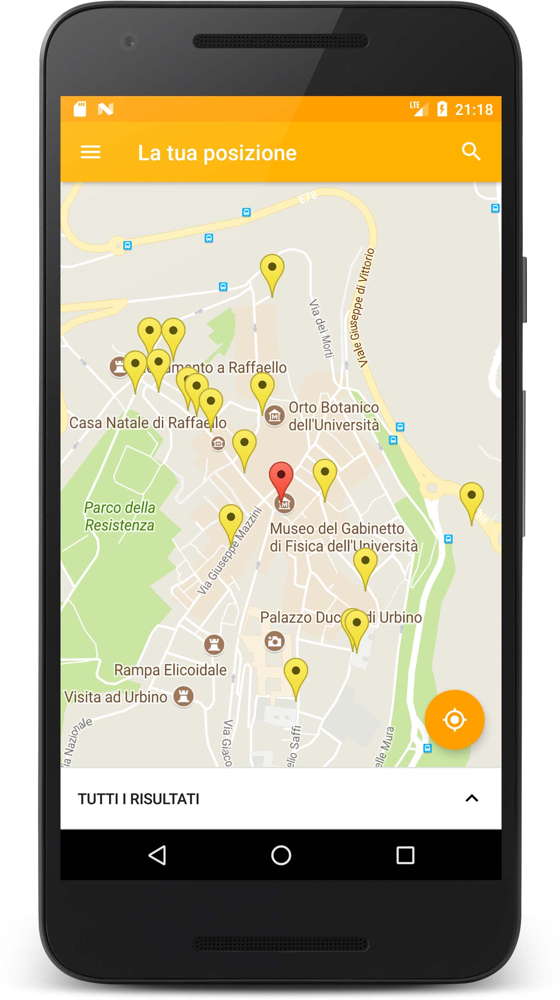

# Iello App per Android #

Questa repository contiene il codice dell'app Android di [Project Iello](https://prezi.com/p/bkqagzs4v_w5/). L'app consente agli utenti di cercare i posteggi per disabili situati in corrispondenza della propria posizione o di un determinato indirizzo. Consente inoltre agli utenti di segnalare eventuali posteggi da loro individuati.

Quest'app è stata pensata per permettere a tutti gli utenti di consultare i dati della piattaforma Iello. Per tale ragione l'app è anche [disponibile nel Play Store](https://play.google.com/store/apps/details?id=com.projectiello.teampiattaforme.iello&hl=it).

## Indice contenuti ##
* [Integrazione con IelloAPI](#integrazione-con-ielloapi)
* [Funzionalità dell'applicazione](#funzionalità-dellapplicazione)
  * [Ricerca tramite geolocalizzazione](#ricerca-tramite-geolocalizzazione)
  * [Ricerca tramite indirizzo](#ricerca-tramite-indirizzo)
  * [Segnalazioni](#segnalazioni)
  * [Personalizzazione](#personalizzazione)
* [Librerie aggiuntive utilizzate](#librerie-aggiuntive-utilizzate)
* [Licenza](#licenza)
* [Contatti & Credits](#contatti--credits)

## Integrazione con IelloAPI ##
L'App Iello sfrutta le funzioni fornite da [Iello API](https://github.com/IelloDevTeam/IelloAPI "Iello API Repo") per reperire i dati relativi ai parcheggi. Viene utilizzata ad esempio la funzione per il download dei dati dei parcheggi attorno ad una data coordinata o per la segnalazione dei posteggi da parte degli utenti.

## Funzionalità dell'applicazione ##

### Ricerca tramite geolocalizzazione ###

La principale funzione dell'app è la ricerca tramite localizzazione. Premendo il tasto FAB in basso a destra nella schermata principale, viene lanciata una ricerca basata sulla posizione dell'utente, fornita dal GPS del proprio smartphone. L'app cerca tutti i posteggi per disabili situati attorno alla posizione dell'utente, entro un raggio specificato (personalizzabile dall'utente), sfruttando l'apposita funzione di Iello API.

Quindi, se sono presenti dei posteggi nelle vicinanze, vengono mostrati nella mappa. Un tap su su un posteggio ne mostra i dettagli, quali l'indirizzo e la distanza dalla propria posizione. 

Premendo sul tasto "vai" associato al posteggio viene lanciato il navigatore di Google Maps, con impostata la funzione di navigazione dalla propria posizione al posteggio selezionato.  

  

### Ricerca tramite indirizzo ###

La ricerca dei posteggi può essere effettuata anche inserendo un indirizzo qualunque, tramite la funzione di ricerca. Premendo sulla lente di ingrandimento in alto a destra, viene mostrata una casella di ricerca, che permette di inserire un indirizzo.

Questo viene interpretato tramite [un'API fornita da Google per il geocoding](https://developers.google.com/maps/documentation/geocoding/intro), ovvero per interpretare un indirizzo e ricavarne le coordinate corrispondenti. 

Inrisposta vengono mostrati i parcheggi per disabili attorno alla posizione selezionata, con le stesse modalità della ricerca tramite geolocalizzazione.     
  

### Segnalazioni ###

L'app permette inoltre agli utenti di segnalare eventuali posteggi non presenti nel database. Dalla schermata segnalazione è possibile selezionare un punto nella mappa ed inviarlo ad un database remoto utilizzato per raccogliere le segnalazioni.

La segnalazione è stata implementata sfruttando l'apposita funzione di IelloAPI, pensata appunto per segnalare posteggi direttamente dall'app. L'utilizzo dell'API permette di rendere completamente indipendenti tra loro l'app e il database remoto. Collegare direttamente l'app al database sarebbe stato possibile, ma avrebbe rappresentato un problema di sicurezza. La funzione di segnalazione dell'API è stata infatti implementata utilizzando appositi [meccanismi di sicurezza](https://github.com/IelloDevTeam/IelloAPI), per evitare modifiche accidentali o non al database, da parte di utenti non autorizzati.  

### Personalizzazione ###
L'app permette di personalizzare alcuni aspetti dell'interfaccia utente. In primo luogo, è possibile cambiare la combinazione di colori della mappa, scegliendo tra alcune combinazioni disponibili. È inoltre possibile modificare l'ampiezza del raggio di ricerca: ampliando il raggio vengono mostrati più parcheggi, se disponibili.

## Librerie aggiuntive utilizzate ##
* **[Android Support Design Libraries](https://developer.android.com/topic/libraries/support-library/index.html)**:
  utilizzato per la creazione delle interfacce secondo le [linee guida di design Google](https://material.io/guidelines/);
* **[Google Maps API](https://developers.google.com/maps/documentation/android-api/)**:
  utilizzato per sfruttare le mappe Google e le relative funzioni, geocoding e reverse geocoding;
* **[Volley](https://github.com/google/volley)**: API sviluppata da Google per effettuare Web request in modo facile, veloce e sicuro;
* **[Firebase Core Services](https://firebase.google.com/docs/reference/android/packages)**: utilizzato per integrare funzionalità di controllo Firebase nell'app;
* **[AppIntro by Paolo Rotolo](https://github.com/apl-devs/AppIntro)**: utilizzata per creare la schermata introduttiva;
* **[ExpandableLayout by Aakira](https://github.com/AAkira/ExpandableLayout)**: utilizzata per i layout espandibili;
* **[MaterialSearchView by Miguel Catalan](https://github.com/MiguelCatalan/MaterialSearchView)**: utilizzata per la barra di ricerca.

## Licenza ##
MIT License

Copyright (c) 2017 IelloDevTeam

Permission is hereby granted, free of charge, to any person obtaining a copy
of this software and associated documentation files (the "Software"), to deal
in the Software without restriction, including without limitation the rights
to use, copy, modify, merge, publish, distribute, sublicense, and/or sell
copies of the Software, and to permit persons to whom the Software is
furnished to do so, subject to the following conditions:

The above copyright notice and this permission notice shall be included in all
copies or substantial portions of the Software.

THE SOFTWARE IS PROVIDED "AS IS", WITHOUT WARRANTY OF ANY KIND, EXPRESS OR
IMPLIED, INCLUDING BUT NOT LIMITED TO THE WARRANTIES OF MERCHANTABILITY,
FITNESS FOR A PARTICULAR PURPOSE AND NONINFRINGEMENT. IN NO EVENT SHALL THE
AUTHORS OR COPYRIGHT HOLDERS BE LIABLE FOR ANY CLAIM, DAMAGES OR OTHER
LIABILITY, WHETHER IN AN ACTION OF CONTRACT, TORT OR OTHERWISE, ARISING FROM,
OUT OF OR IN CONNECTION WITH THE SOFTWARE OR THE USE OR OTHER DEALINGS IN THE
SOFTWARE.

## Contatti & Credits ##
App realizzata come parte di un progetto di esame (PDGT) da [Riccardo Maldini](https://github.com/maldins46), [Andrea Petreti](https://github.com/petretiandrea), [Alessia Ventani](https://github.com/AlessiaVe) e [Elia Trufelli](https://github.com/EliaT95).
