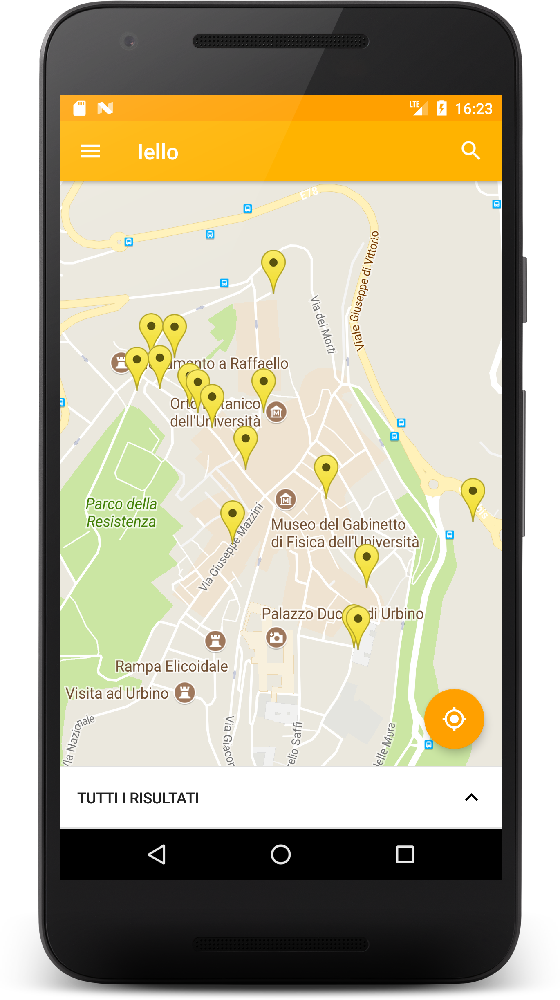
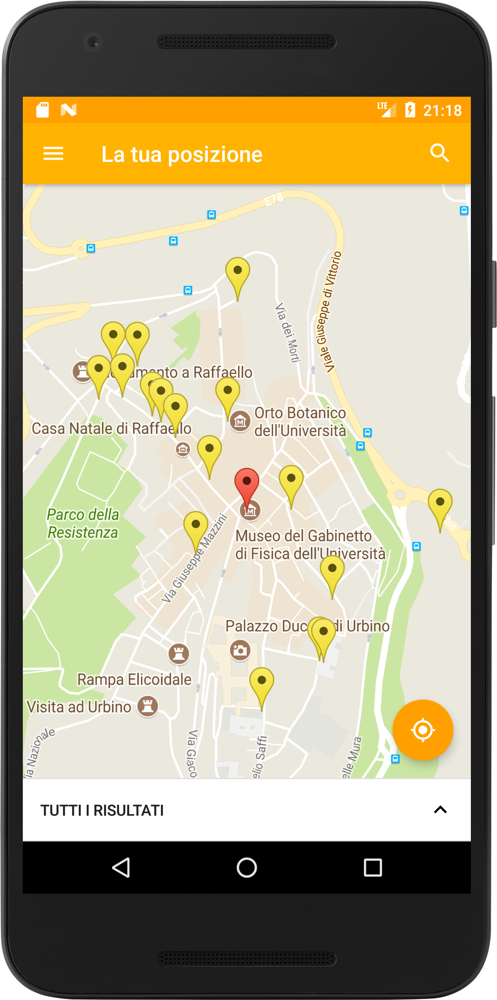
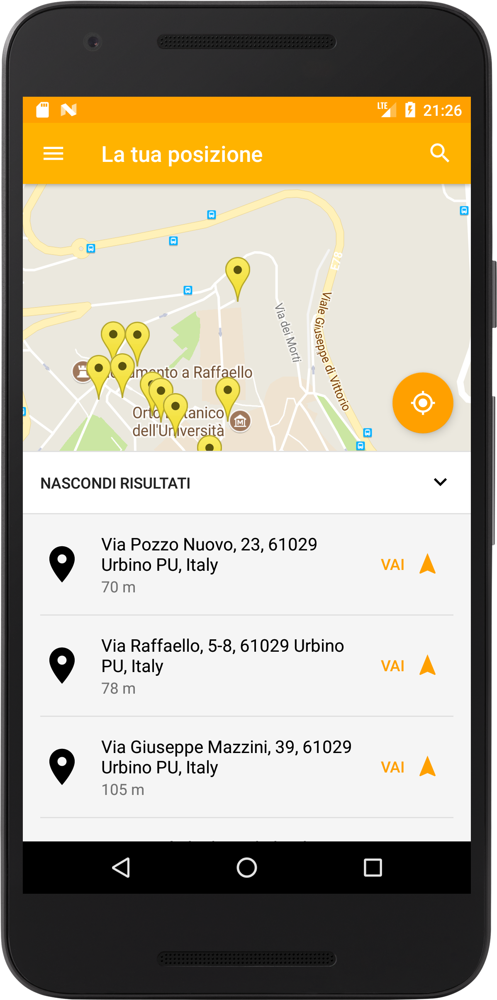
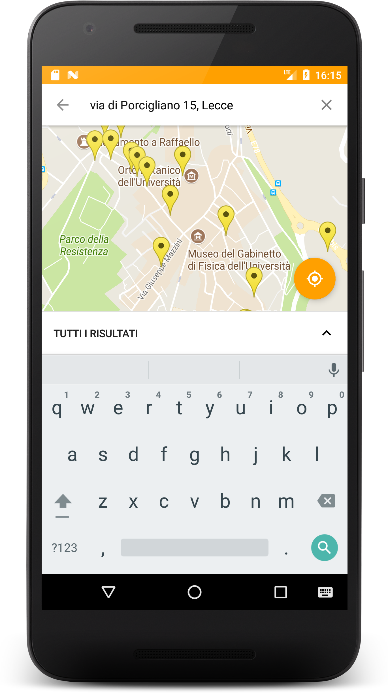
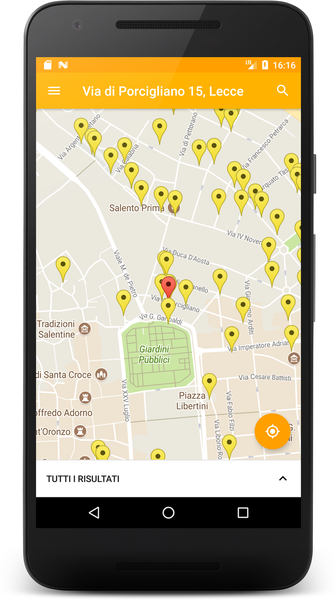
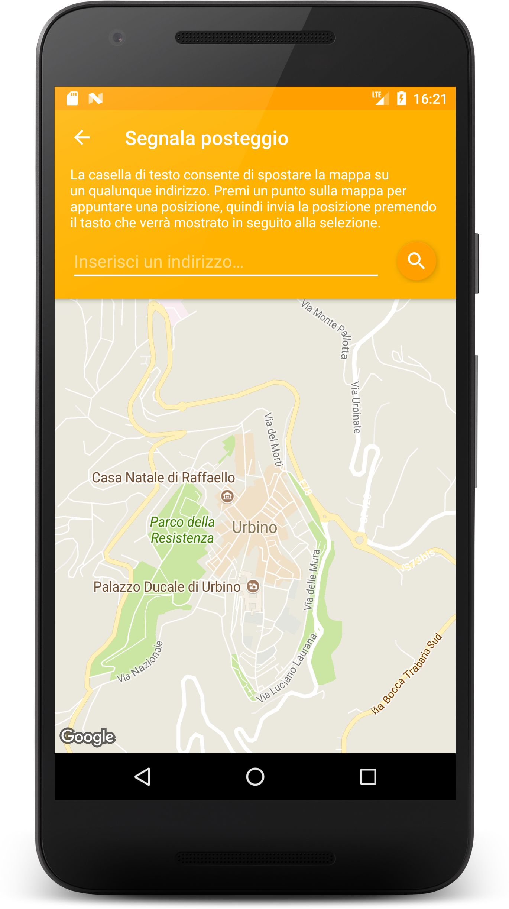
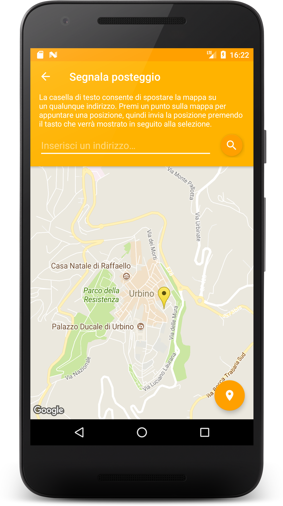
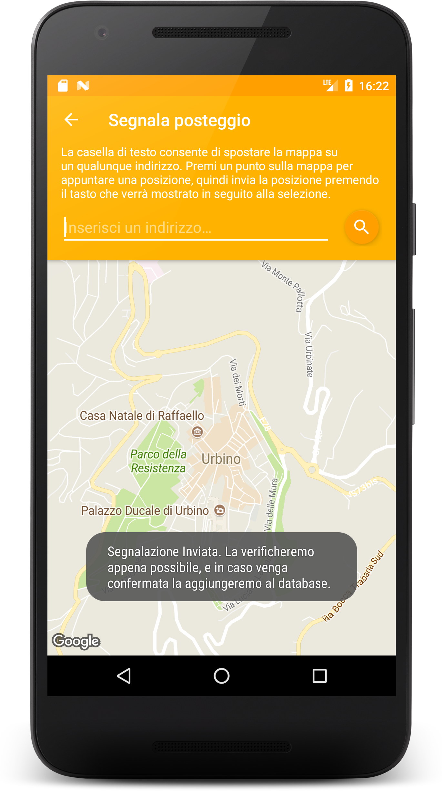

# Iello App per Android #

Questa repository contiene il codice dell'app Android di Project Iello. L'app consente agli utenti di cercare i posteggi per disabili situati in corrispondenza della propria posizione, o di un determinato indirizzo. Consente inoltre agli utenti di segnalare eventuali posteggi da loro individuati.

## Integrazione con Iello API ##
L'App Iello sfrutta le funzioni fornite da [Iello API](https://github.com/IelloDevTeam/IelloAPI "Iello API Repo") per reperire i dati relativi ai parcheggi. Viene utilizzata ad esempio la funzione per il download dei dati dei parcheggi attorno ad una data coordinata, o per la segnalazione dei posteggi da parte degli utenti.

## Funzionalità dell'applicazione ##

### Ricerca tramite geolocalizzazione ###
La principale funzione dell'app è la ricerca tramite localizzazione. Premendo il tasto FAB in basso a destra nella schermata principale, viene lanciata una ricerca basata sulla posizione dell'utente, fornita dal GPS del proprio smartphone. L'app cerca tutti i posteggi per disabili situati attorno alla posizione dell'utente, entro un raggio specificato (personalizzabile dall'utente), sfruttando l'apposita funzione di Iello API.

Quindi, se sono presenti dei posteggi nelle vicinanze, vengono mostrati nella mappa. Un tap su sun posteggio ne mostra i dettagli, quali l'indirizzo e la distanza dalla propria posizione. 

Premendo sul tasto "vai" associato al posteggio viene lanciato il navigatore di Google Maps, con impostata la funzione di navigazione dalla propria posizione al posteggio selezionato.

Premi il tasto di geolocalizzazione | Visualizza la tua posizione | Consulta i parcheggi
:---------------------------:|:----------------------------:|:---------------------------:
 |  | 

### Ricerca tramite indirizzo ###
La ricerca dei posteggi può essere effettuata anche inserendo un indirizzo qualunque, tramite la funzione di ricerca. Premendo sulla lente di ingrandimento in alto a destra, viene mostrata una casella di ricerca, che permette di inserire un indirizzo.

Premi il tasto di ricerca | Inserisci un indirizzo | Consulta i parcheggi
:---------------------------:|:----------------------------:|:---------------------------:
 |  | 

Questo viene interpretato tramite un'API fornita da Google per il geocoding, ovvero per interpretare un indirizzo e ricavarne le coordinate corrispondenti. 

Quindi vengono mostrati i parcheggi per disabili attorno alla posizione selezionata, con le stesse modalità della ricerca tramite geolocalizzazione.

### Segnalazioni ###
L'app permette inoltre agli utenti di segnalare eventuali posteggi non presenti nel database. Dalla schermata segnalazione è possibile selezionare un punto nella mappa ed inviarlo ad un database remoto utilizzato per raccogliere le segnalazioni.

Accedi alla sezione segnalazione | Seleziona una posizione | Inviala al DB remoto (tramite API)
:---------------------------:|:----------------------------:|:---------------------------:
 |  | 

La segnalazione è stata implementata sfruttando l'apposita funzione di IelloAPI, pensata appunto per segnalare posteggi direttamente dall'app. L'utilizzo dell'API permette di rendere completamente indipendenti tra loro l'app e il database remoto. Collegare direttamente l'app al database sarebbe stato possibile, ma avrebbe rappresentato un problema di sicurezza. La funzione di segnalazione dell'API è stata infatti implementata utilizzando appositi [meccanismi di sicurezza](https://github.com/IelloDevTeam/IelloAPI), per evitare modifiche accidentali o non al database, da parte di utenti non autorizzati.

### Personalizzazione ###
L'app permette di personalizzare alcuni aspetti dell'esperienza utente. In primo luogo, è possibile cambiare la combinazione di colori della mappa, scegliendo tra alcune combinazioni disponibili. È inoltre possibile modificare l'ampiezza del raggio di ricerca; ampliando il raggio vengono mostrati più parcheggi, se disponibili.

## Librerie aggiuntive utilizzate ##
* **[Android Support Design Libraries](https://developer.android.com/topic/libraries/support-library/index.html)**:
  utilizzato per la creazione delle interfacce secondo le [linee guida di design Google](https://material.io/guidelines/);
* **[Google Maps API](https://developers.google.com/maps/documentation/android-api/)**:
  utilizzato per sfruttare le mappe Google e le relative funzioni, geocoding e reverse geocoding;
* **[Volley](https://github.com/google/volley)**: API sviluppata da Google per effettuare Web request in modo più facile, veloce e sicuro;
* **[AppIntro by Paolo Rotolo](https://github.com/apl-devs/AppIntro)**: utilizzata per creare la schermata introduttiva;
* **[ExpandableLayout by Aakira](https://github.com/AAkira/ExpandableLayout)**: utilizzata per i layout espandibili;
* **[MaterialSearchView by Miguel Catalan](https://github.com/MiguelCatalan/MaterialSearchView)**: utilizzata per la barra di ricerca.

## Licenza ##
Copyright (C) 2017 IelloDevTeam

Licensed under the Apache License, Version 2.0 (the "License");
you may not use this file except in compliance with the License.
You may obtain a copy of the License at http://www.apache.org/licenses/LICENSE-2.0.

Unless required by applicable law or agreed to in writing, software
distributed under the License is distributed on an "AS IS" BASIS,
WITHOUT WARRANTIES OR CONDITIONS OF ANY KIND, either express or implied.
See the License for the specific language governing permissions and
limitations under the License.

## Contatti & Credits ##
App realizzata come parte di un progetto di esame (PDGT) da [Riccardo Maldini](https://github.com/maldins46), [Andrea Petreti](petretiandrea), [Alessia Ventani](https://github.com/AlessiaVe) e [Elia Trufelli](https://github.com/EliaT95).
